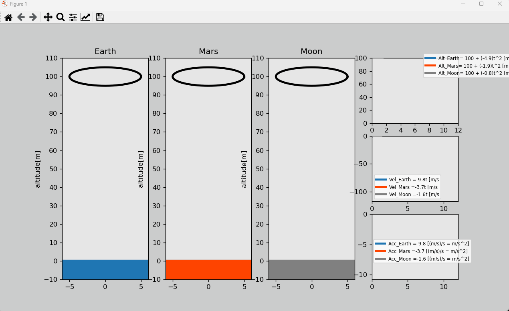

# Gravity – Simulação Científica em Python

Este projeto é inspirado no curso **"Python Engineering Animations: Bring Math & Data to Life"** da Udemy.  
Ele apresenta uma animação científica que demonstra o comportamento de partículas sob o efeito da gravidade nos planetas **Marte**, **Terra** e **Lua**.

---

## 🎥 Prévia da Animação



---

## 🚀 Funcionalidades
- Simulação da força gravitacional em diferentes planetas.
- Visualização animada em Python.
- Escalas físicas aproximadas para maior realismo.

---

## 🛠️ Tecnologias Utilizadas
- **Python 3.x**
- **Matplotlib** – para criação das animações.
- **NumPy** – para cálculos matemáticos e físicos.

---

## 📦 Instalação e Execução

```bash
# Clone o repositório
git clone https://github.com/JsnEvt/gravity.git

# Acesse o diretório do projeto
cd gravity

# Instale as dependências
pip install -r requirements.txt

# Execute a simulação
python gravity.py
